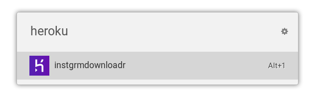

# Ulauncher Heroku

[](https://ext.ulauncher.io/-/github-brpaz-ulauncher-heroku)
[](https://circleci.com/gh/brpaz/ulauncher-heroku)


> [ulauncher](https://ulauncher.io/) Extension to access your [Heroku](https://heroku.com) projects from Ulauncher




## Requirements

* [ulauncher 5](https://ulauncher.io/)
* Python >=3
* A [heroku](https://heroku.com) account.

This extension uses the `requests` Python package.

If you don´t have it installed, please install it with the following command:

```bash
pip install requests --user
```


## Install

Open ulauncher preferences window -> extensions -> add extension and paste the following url:

```https://github.com/brpaz/ulauncher-heroku```

## Usage

* Before usage you need to configure your heroku "auth_token" in plugin preferences. You can get yours at [Heroku Account page](https://dashboard.heroku.com/account/applications).
* Typing the extension keyword ("heroku" by default) will trigger a search on your Heroku Applications. The results will be cached by 1h.
* Tapping "enter" on a result item will open the respective site on your default browser while tapping "alt+enter" will open the admin page on Heroku.


## Development

```
make link
```

To see your changes, stop ulauncher and run it from the command line with: ```ulauncher -v```.

## Contributing

Contributions, issues and Features requests are welcome.

## Show your support

<a href="https://www.buymeacoffee.com/Z1Bu6asGV" target="_blank"></a>


## License

Copywright @ 2019 [Bruno Paz](https://github.com/brpaz)

This project is [MIT](LLICENSE) Licensed.
